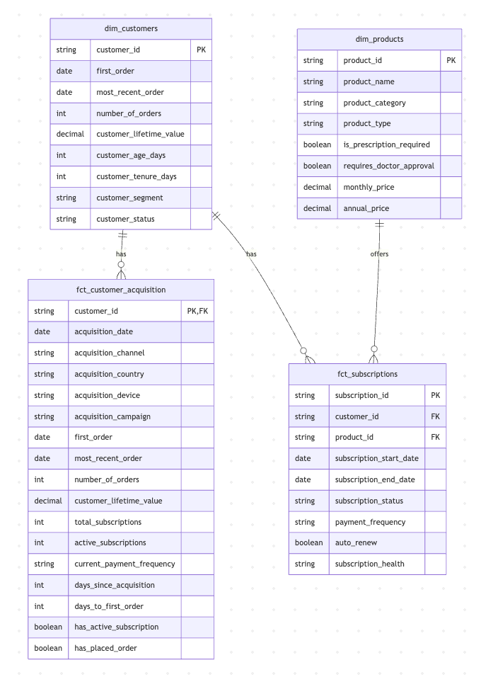

# Healthcare Subscription Analytics

This project provides analytics for a healthcare subscription business, focusing on customer retention and subscription analysis.

## Entity Relationship Diagram



## Key Features

- Customer retention analysis by cohort
- Subscription and product analytics
- Healthcare-specific metrics
- Multi-dimensional analysis capabilities

## Data Models

### Customer Retention Model

The customer retention model provides comprehensive analytics on customer behavior and retention patterns, including:

- Cohort-based analysis
- Product category analysis
- Subscription status tracking
- Healthcare-specific metrics

### Subscription Analytics

Track and analyze subscription patterns:

- Subscription status and lifecycle
- Payment frequency analysis
- Auto-renewal impact
- Healthcare service utilization

### Product Analytics

Monitor healthcare product performance:

- Product category performance
- Prescription vs non-prescription analysis
- Doctor approval requirements
- Service utilization patterns

# Quickstart
**Doesn't work as BQ SQL, but you get the idea**

```shell
python3 -m venv venv
source venv/bin/activate
python3 -m pip install --upgrade pip
python3 -m pip install -r requirements.txt
source venv/bin/activate
dbt build
dbt docs generate
dbt docs serve
```


<summary>GitHub Codespaces / Dev Containers </summary>

#### Steps

I really like dev containers after working cross-OS for a while. Everything _just works_.
Basic Dev container setup below. I always add set extensions and settings for easier onboarding

1. Install [Docker Desktop](https://www.docker.com/products/docker-desktop/)
2. Install the VSCode [Dev Containers](https://marketplace.visualstudio.com/items?itemName=ms-vscode-remote.remote-containers) extension (formerly known as the "Remote - Containers" extension). Video tutorial [here](https://learn.microsoft.com/en-us/shows/beginners-series-to-dev-containers/installing-the-remote-containers-extension-2-of-8--beginners-series-to-dev-containers).
2. Clone this repo and open it in VSCode
1. First time: View > Command Palette > Remote-Containers: Open Folder in Container
    - Wait for container to build -- expected to take several minutes
    - Open a new terminal
3. Subsequent times: Click **Reopen in Container** and wait for container to spin up
   

### Query the data
## Browsing the data
Some options:
- [DuckDB UI](https://duckdb.org/docs/stable/extensions/ui.html)
- [duckcli](https://pypi.org/project/duckcli/)
- [DuckDB CLI](https://duckdb.org/docs/installation/?environment=cli)
- [How to set up DBeaver SQL IDE for DuckDB](https://duckdb.org/docs/guides/sql_editors/dbeaver)

### DuckDB CLI
**Note it won't actually run as I wanted to use BQ SQL which has a lot of non-ansi. It was fun to setup but a waste of time really**
1. Load the CSVs with the demo data set, run the models, and test the output of the models using the [dbt build](https://docs.getdbt.com/reference/commands/build) command:
    ```shell
    dbt build
    ```

If it did run:
    ```shell
    duckcli jaffle_shop.duckdb -e "select * from customers where customer_id = 42"
    ```

1. Generate and view the documentation for the project:
    ```shell
    dbt docs generate
    dbt docs serve
    ```